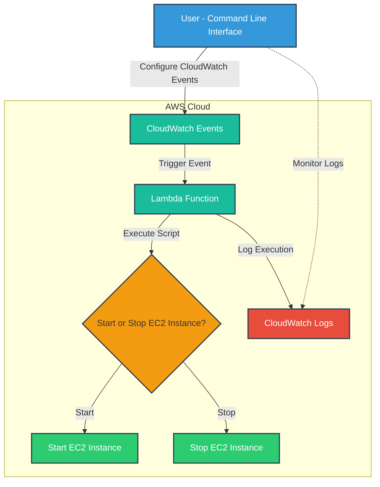

# EC2 Auto Shutdown and Start

As a software engineering team, we are working with Amazon EC2 instances on a daily basis While EC2 instances are great for running applications and services but its important to properly manage our instances to avoid unnecessary costs and resource consumption. One way to do this is by automating the shutdown and start of your EC2 instances

This project automates the start and stop of AWS EC2 instances based on scheduled CloudWatch Events using an AWS Lambda function. It leverages Ruby AWS SDK for creating the Lambda function, CloudWatch Events, and EC2 instance management. You can configure the instance and schedule using the CLI.

## Project Overview

The project allows you to:
- Create a Lambda function that automatically starts or stops EC2 instances based on their current state (i.e., running or stopped).
- Schedule EC2 instance start/stop operations using CloudWatch Events.
- Manage the schedule and EC2 instance operations through a Ruby-based CLI.



## Features

- **Lambda function**: Automatically manages the start and stop of EC2 instances.
- **CloudWatch Events**: Schedules based on cron expressions to run the Lambda function at specific times.
- **CLI Interface**: Easy-to-use interface for setting up the Lambda function and managing EC2 instance operations.

---

## Prerequisites

- **AWS CLI**: Ensure that the AWS CLI is installed and configured with access to your AWS account.
- **Ruby 3.x**: The project requires Ruby version 3.x. Install Ruby using a version manager like RVM or rbenv.
- **AWS SDK for Ruby**: The project uses `aws-sdk-ec2` and `aws-sdk-cloudwatchevents` gems.
- **IAM Permissions**: Ensure the AWS user you are using has permissions to:

Required IAM Permissions


1. CloudWatch Events Permissions

	- events:PutRule: Create or update CloudWatch event rules.
	- events:ListRules: List existing event rules.
	- events:DescribeRule: Retrieve details about a specific event rule.
	- events:PutTargets: Associate targets with CloudWatch event rules.
	- events:RemoveTargets: Remove targets from CloudWatch event rules.
	- events:DeleteRule: Delete an event rule.
	- events:ListTargetsByRule: List targets associated with a specific rule.

2. EC2 Permissions

	- ec2:DescribeInstances: Retrieve information about EC2 instances.
	- ec2:StartInstances: Start EC2 instances (if applicable).
	- ec2:StopInstances: Stop EC2 instances (if applicable).

3. Lambda Permissions

	- lambda:AddPermission: Allow CloudWatch Events to invoke the Lambda function.
	- lambda:RemovePermission: Remove permissions that allow invocation of the Lambda function.
	- lambda:InvokeFunction: Allow invocation of the specified Lambda function (if needed directly).
	- lambda:CreateFunction: Create a new Lambda function.
	- lambda:GetFunction: Retrieve details about a specific Lambda function.

4. IAM Permissions

	- iam:GetRole: Retrieve details about a specific IAM role.
	- iam:PassRole: Allow passing a role to the Lambda service, if required.

```json
{
	"Version": "2012-10-17",
	"Statement": [
		{
			"Effect": "Allow",
			"Action": [
				"events:PutRule",
				"events:ListRules",
				"events:DescribeRule",
				"events:PutTargets",
				"events:RemoveTargets",
				"events:DeleteRule",
				"events:ListTargetsByRule"
			],
			"Resource": "*"
		},
		{
			"Effect": "Allow",
			"Action": [
				"ec2:DescribeInstances",
				"ec2:StartInstances",
				"ec2:StopInstances"
			],
			"Resource": "*"
		},
		{
			"Effect": "Allow",
			"Action": [
				"lambda:AddPermission",
				"lambda:RemovePermission",
				"lambda:InvokeFunction",
				"lambda:CreateFunction",
				"lambda:GetFunction"
			],
			"Resource": "arn:aws:lambda:<region>:<account-id>:function:*"
		},
		{
			"Effect": "Allow",
			"Action": [
				"iam:GetRole",
				"iam:PassRole",
				"lambda:GetFunction"
			],
			"Resource": [
				"arn:aws:iam::<account-id>:role/<role-name>",
				"arn:aws:iam::<account-id>:role/*",
				"arn:aws:lambda:<region>:<account-id>:function:<function-name>"
			]
		}
	]
}
```

---

## Setup Instructions

### 1. Clone the Repository

```bash
git clone [https://github.com/maniSHarma7575/hibernate.git](https://github.com/maniSHarma7575/hibernate.git)
cd hibernate
```

### 2. Install Dependencies

Make sure you have the required gems by running:

```bash
bundle install
```

### 3. Environment Configuration

Create a `config.yaml` file at the root of your project and configure your AWS account details as follows:

```yaml
aws_accounts:
  account_name_1:
    account_id: "<account_id_1>"
    region: us-east-1
    credentials:
      access_key_id: ACCESS_KEY_1
      secret_access_key: SECRET_KEY_1
  account_name_2:
    account_id:<account_id_2>
    region: us-west-2
    credentials:
      access_key_id: ACCESS_KEY_2
      secret_access_key: SECRET_KEY_2
```

## Usage

The project includes a CLI to manage the setup of the Lambda function and CloudWatch Events. Here’s how you can use it:

### 1. Setup the Lambda Function

Run the following command to set up the Lambda function:

```bash
bin/hibernate setup --profile=<profile_name>
```

This command will:
- Create an IAM role (if it doesn't exist).
- Create the Lambda function.
- Attach the necessary permissions for managing EC2 instances.

### 2. Manage EC2 Instances with Scheduled Start/Stop

Use the following command to create or update rules for EC2 instances with scheduled start/stop times:

```bash
bin/hibernate rule --create --profile=<profile_name> --instance-name=<instance_name> --start-expression="<cron>" --stop-expression="<cron>"
```
- `--profile=<profile_name>`: (Optional) The Profile to use from config. This will default to the default profile if not specified.
- `--instance-name=<instance_name>`: The EC2 instance name tag.
- `--start-expression=<cron>`: The cron expression for when to start the instance.
- `--stop-expression=<cron>`: The cron expression for when to stop the instance.

Both `--start-expression` and `--stop-expression` are optional, but at least one must be provided.

#### Example:

```bash
bin/hibernate rule --create --profile=<profile_name> --instance-name="hibernate" --start-expression="55 9 * * ? *" --stop-expression="50 9 * * ? *"
```

This schedules the instance named "hibernate" to start at 9:55 AM UTC and stop at 9:50 AM UTC.

### 3. List Scheduled Start/Stop Rules

To list all scheduled start/stop rules for all EC2 instances:

```bash
bin/hibernate rule --list --profile=<profile_name>
```

To list rules for a specific EC2 instance or filter by start/stop rules:

```bash
bin/hibernate rule --list --profile=<profile_name> [--instance-name=<instance_name>] [--start-instance=true] [--stop-instance=true]
```

Parameters:
- `--instance-name=<instance_name>`: The name tag of the EC2 instance whose rules you want to list (optional).
- `--start-instance=true`: (Optional) Include this flag to list only the start rules.
- `--stop-instance=true`: (Optional) Include this flag to list only the stop rules.

#### Examples:

```bash
bin/hibernate rule --list --profile=<profile_name> --instance-name=hibernate
bin/hibernate rule --list --profile=<profile_name> --start-instance=true
```

### 4. Update Existing Rules

To update an existing rule:

```bash
bin/hibernate rule --update --profile=<profile_name> --rule=<rule_name> [--start-expression="<new_cron>"] [--stop-expression="<new_cron>"] [--state=<new_state>]
```

- `--rule=<rule_name>`: The name of the rule to update.
- `--start-expression="<new_cron>"`: (Optional) The new cron expression for starting the instance.
- `--stop-expression="<new_cron>"`: (Optional) The new cron expression for stopping the instance.
- `--state=<new_state>`: (Optional) The new state of the rule. Use "enable" to enable the rule or "disable" to disable it.

#### Example:

```bash
bin/hibernate rule --update --profile=<profile_name> --rule=StartInstanceRule-i-0ad52c31c25c659aa-9afb6fd6 --start-expression="20 12 * * ? *"
```

This updates the start rule to trigger at 12:20 PM UTC.

Disable a rule:

```bash
bin/hibernate rule --update --profile=<profile_name> --rule=StopInstanceRule-i-0ad52c31c25c659aa-d1751fc4 --state=disable
```

### 5. Remove Scheduled Start/Stop Rules

Use the following command to remove a specific rule:

```bash
bin/hibernate rule --remove --profile=<profile_name> --rule-name=<rule_name>
```

- `--rule-name=<rule_name>`: Specify the rule you want to delete.

#### Example:

```bash
bin/hibernate rule --remove --profile=<profile_name> --rule-name=<rule_name>
```

This will remove the specified CloudWatch rule.

### Cron Expressions in AWS CloudWatch Events

CloudWatch Events uses the following format for cron expressions:

```
cron(Minutes Hours Day-of-month Month Day-of-week Year)
```

- **Example**: `cron(55 9 * * ? *)` runs every day at 9:55 AM UTC.

### Summary of Commands

- **Setup Lambda**: `bin/hibernate setup --profile=<profile_name>`
- **Create/Update Rule**: `bin/hibernate rule --create --instance-name=<instance_name> --start-expression=<cron> --stop-expression=<cron>`
- **List Rules**: `bin/hibernate rule --list [--instance-name=<instance_name>] [--start-instance=true] [--stop-instance=true]`
- **Update Rule**: `bin/hibernate rule --update --rule=<rule_name> [--start-expression=<new_cron>] [--stop-expression=<new_cron>] [--state=<new_state>]`
- **Remove Rule**: `bin/hibernate rule --remove --rule-name=<rule_name>`

---

### Resources:
- [AWS Cron Expressions](https://docs.aws.amazon.com/AmazonCloudWatch/latest/events/ScheduledEvents.html)

## Contributing

Feel free to submit pull requests or report issues. We welcome contributions to enhance the functionality of the project.

---

## License

This project is licensed under the MIT License. See the `LICENSE` file for details.

---

### Final Notes

- Ensure your AWS credentials are properly configured in the `.env` file.
- Test the Lambda function thoroughly before deploying it to production environments.
