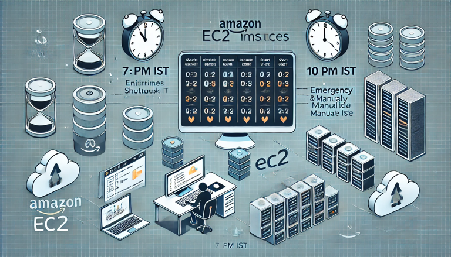

# EC2 Auto Shutdown and Start

As a software engineering team, we are working with Amazon EC2 instances on a daily basis While EC2 instances are great for running applications and services but its important to properly manage our instances to avoid unnecessary costs and resource consumption. One way to do this is by automating the shutdown and start of your EC2 instances

This project automates the start and stop of AWS EC2 instances based on scheduled CloudWatch Events using an AWS Lambda function. It leverages Ruby AWS SDK for creating the Lambda function, CloudWatch Events, and EC2 instance management. You can configure the instance and schedule using the CLI.

## Project Overview

The project allows you to:
- Create a Lambda function that automatically starts or stops EC2 instances based on their current state (i.e., running or stopped).
- Schedule EC2 instance start/stop operations using CloudWatch Events.
- Manage the schedule and EC2 instance operations through a Ruby-based CLI.



## Features

- **Lambda function**: Automatically manages the start and stop of EC2 instances.
- **CloudWatch Events**: Schedules based on cron expressions to run the Lambda function at specific times.
- **CLI Interface**: Easy-to-use interface for setting up the Lambda function and managing EC2 instance operations.

---

## Prerequisites

- **AWS CLI**: Ensure that the AWS CLI is installed and configured with access to your AWS account.
- **Ruby 3.x**: The project requires Ruby version 3.x. Install Ruby using a version manager like RVM or rbenv.
- **AWS SDK for Ruby**: The project uses `aws-sdk-ec2` and `aws-sdk-cloudwatchevents` gems.
- **IAM Permissions**: Ensure the AWS user you are using has permissions to:
  - Manage EC2 instances.
  - Create CloudWatch Events.
  - Create and manage Lambda functions.
  - Create and assign IAM roles and policies.

---

## Setup Instructions

### 1. Clone the Repository

```bash
git clone [https://github.com/maniSHarma7575/hibernate.git](https://github.com/maniSHarma7575/hibernate.git)
cd hibernate
```

### 2. Install Dependencies

Make sure you have the required gems by running:

```bash
bundle install
```

### 3. Environment Configuration

Create a `.env` file at the root of your project and configure your AWS credentials:

```bash
AWS_ACCESS_KEY_ID=<your-access-key-id>
AWS_SECRET_ACCESS_KEY=<your-secret-access-key>
AWS_REGION=<your-aws-region>
ACCOUNT_ID=<your-account-id>
```

---

## Usage

The project includes a CLI to manage the setup of the Lambda function and CloudWatch Events. Here’s how you can use it:

### 1. Setup the Lambda Function

Run the following command to set up the Lambda function:

```bash
bin/hibernate setup
```

This command will:
- Create an IAM role (if it doesn't exist).
- Create the Lambda function.
- Attach the necessary permissions for managing EC2 instances.

### 2. Manage EC2 Instances with Scheduled Start/Stop

Use the following command to manage EC2 instances with scheduled start/stop times:

```bash
bin/hibernate node --in=<instance_name> --start_instance="cron(34 16 * * ? *)" --stop_instance="cron(0 22 * * ? *)"
```

- `--in=<instance_name>`: The EC2 instance name tag.
- `--start_instance=<cron>`: The cron expression for when to start the instance.
- `--stop_instance=<cron>`: The cron expression for when to stop the instance.

Example:

```bash
bin/hibernate node --in=my-instance --start_instance="cron(34 16 * * ? *)" --stop_instance="cron(0 22 * * ? *)"
```

This schedules the instance to start at 4:34 PM UTC and stop at 10:00 PM UTC.


## Cron Expressions in AWS CloudWatch Events

CloudWatch Events uses the following format for cron expressions:

```
cron(Minutes Hours Day-of-month Month Day-of-week Year)
```

- **Example**: `cron(34 16 * * ? *)` runs every day at 4:34 PM UTC.

### Resources:
- [AWS Cron Expressions](https://docs.aws.amazon.com/AmazonCloudWatch/latest/events/ScheduledEvents.html)

## Contributing

Feel free to submit pull requests or report issues. We welcome contributions to enhance the functionality of the project.

---

## License

This project is licensed under the MIT License. See the `LICENSE` file for details.

---

### Final Notes

- Ensure your AWS credentials are properly configured in the `.env` file.
- Test the Lambda function thoroughly before deploying it to production environments.