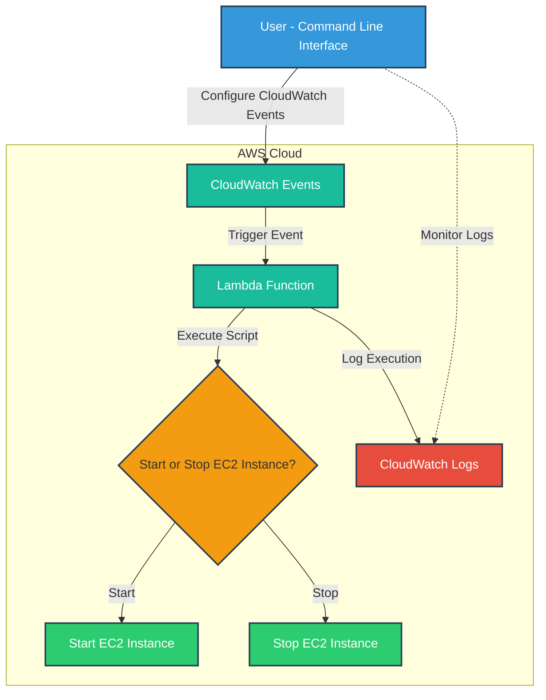

# EC2 Auto Shutdown and Start

As a software engineering team, we are working with Amazon EC2 instances on a daily basis While EC2 instances are great for running applications and services but its important to properly manage our instances to avoid unnecessary costs and resource consumption. One way to do this is by automating the shutdown and start of your EC2 instances

This project automates the start and stop of AWS EC2 instances based on scheduled CloudWatch Events using an AWS Lambda function. It leverages Ruby AWS SDK for creating the Lambda function, CloudWatch Events, and EC2 instance management. You can configure the instance and schedule using the CLI.

### Watch demonstration

[](https://youtu.be/a_7fglcBAxE?si=wEGlH4ZeObCrjUir)

## Project Overview

The project allows you to:
- Create a Lambda function that automatically starts or stops EC2 instances based on their current state (i.e., running or stopped).
- Schedule EC2 instance start/stop operations using CloudWatch Events.
- Manage the schedule and EC2 instance operations through a Ruby-based CLI.



## Features

- **Lambda function**: Automatically manages the start and stop of EC2 instances.
- **CloudWatch Events**: Schedules based on cron expressions to run the Lambda function at specific times.
- **CLI Interface**: Easy-to-use interface for setting up the Lambda function and managing EC2 instance operations.

---

## Prerequisites

- **AWS CLI**: Ensure that the AWS CLI is installed and configured with access to your AWS account.
- **Ruby 3.x**: The project requires Ruby version 3.x. Install Ruby using a version manager like RVM or rbenv.
- **AWS SDK for Ruby**: The project uses `aws-sdk-ec2` and `aws-sdk-cloudwatchevents` gems.
- **IAM Permissions**: Ensure the AWS user you are using has permissions to:

Required IAM Permissions


1. CloudWatch Events Permissions

	- events:PutRule: Create or update CloudWatch event rules.
	- events:ListRules: List existing event rules.
	- events:DescribeRule: Retrieve details about a specific event rule.
	- events:PutTargets: Associate targets with CloudWatch event rules.
	- events:RemoveTargets: Remove targets from CloudWatch event rules.
	- events:DeleteRule: Delete an event rule.
	- events:ListTargetsByRule: List targets associated with a specific rule.

2. EC2 Permissions

	- ec2:DescribeInstances: Retrieve information about EC2 instances.
	- ec2:StartInstances: Start EC2 instances (if applicable).
	- ec2:StopInstances: Stop EC2 instances (if applicable).

3. Lambda Permissions

	- lambda:AddPermission: Allow CloudWatch Events to invoke the Lambda function.
	- lambda:RemovePermission: Remove permissions that allow invocation of the Lambda function.
	- lambda:InvokeFunction: Allow invocation of the specified Lambda function (if needed directly).
	- lambda:CreateFunction: Create a new Lambda function.
	- lambda:GetFunction: Retrieve details about a specific Lambda function.

4. IAM Permissions

	- iam:GetRole: Retrieve details about a specific IAM role.
	- iam:PassRole: Allow passing a role to the Lambda service, if required.

```json
{
    "Version": "2012-10-17",
    "Statement": [
        {
            "Effect": "Allow",
            "Action": [
                "events:PutRule",
                "events:ListRules",
                "events:DescribeRule",
                "events:PutTargets",
                "events:RemoveTargets",
                "events:DeleteRule",
                "events:ListTargetsByRule"
            ],
            "Resource": "*"
        },
        {
            "Effect": "Allow",
            "Action": [
                "ec2:DescribeInstances",
                "ec2:StartInstances",
                "ec2:StopInstances"
            ],
            "Resource": "*"
        },
        {
            "Effect": "Allow",
            "Action": [
                "lambda:AddPermission",
                "lambda:RemovePermission",
                "lambda:InvokeFunction",
                "lambda:CreateFunction",
                "lambda:GetFunction"
            ],
            "Resource": "arn:aws:lambda:<region>:<account_id>:function:*"
        },
        {
            "Effect": "Allow",
            "Action": [
                "iam:GetRole",
                "iam:PassRole",
                "iam:CreateRole",
                "lambda:GetFunction",
                "iam:PutRolePolicy",
                "iam:AttachRolePolicy"
            ],
            "Resource": [
                "arn:aws:iam::<account_id>:role/ec2-auto-shutdown-start",
                "arn:aws:iam::<account_id>:role/*",
                "arn:aws:lambda:<region>:<account_id>:function:ec2_auto_shutdown_start_function"
            ]
        }
    ]
}
```

---

## Setup Instructions

### 1. Clone the Repository

```bash
git clone [https://github.com/maniSHarma7575/hibernate.git](https://github.com/maniSHarma7575/hibernate.git)
cd hibernate
```

### 2. Environment Configuration

Create a `config.yaml` file at the root of your project and configure your AWS account details as follows:

```yaml
aws_accounts:
  profile_name:
    account_id: "<account_id_1>"
    region: us-east-1
    credentials:
      access_key_id: ACCESS_KEY_1
      secret_access_key: SECRET_KEY_1
  profile_other:
    account_id:<account_id_2>
    region: us-west-2
    credentials:
      access_key_id: ACCESS_KEY_2
      secret_access_key: SECRET_KEY_2
```

### 3. Install Dependencies

Make sure you have the required gems and build the gem by running:

```bash
rake install
```

Here’s how the Usage section for the Readme.md can be structured based on your script:

## Usage

Automate the shutdown and start of EC2 instances using scheduled rules.

### Available Commands

- **setup**: Set up the AWS IAM role and Lambda function for managing EC2 instance schedules.
- **rule**: Manage schedules for EC2 instance start/stop actions.
  - **create**: Create a new start/stop schedule.
  - **list**: List existing schedules.
  - **update**: Update an existing schedule.
  - **remove**: Remove an existing schedule.

```bash
hibernate --help
```

### Command Usage

#### Setup Command

```bash
hibernate setup --profile <PROFILE_NAME>
```

Options:

-	-p, --profile: Specify the AWS profile name (required).

#### Rule Command

**Create a Schedule**

```bash
hibernate rule create --profile <PROFILE_NAME> --instance-name <INSTANCE_NAME> --start <CRON_START> --stop <CRON_STOP>
```

Options:

-	-p, --profile: Specify the AWS profile name (required).
-	-i, --instance-name: Specify the EC2 instance name (required).
-	-s, --start: Specify the cron expression for starting the instance (optional).
-	-e, --stop: Specify the cron expression for stopping the instance (optional).

**List Schedules**

```bash
hibernate rule list --profile <PROFILE_NAME> --instance-name <INSTANCE_NAME> [--start] [--stop]
```
Options:

-	-p, --profile: Specify the AWS profile name (required).
-	-i, --instance-name: Specify the EC2 instance name (required).
-	-s, --start: List only the start action rules (optional).
-	-e, --stop: List only the stop action rules (optional).

**Update a Schedule**

```bash
hibernate rule update --profile <PROFILE_NAME> --rule <RULE_NAME> --start <NEW_CRON_START> --stop <NEW_CRON_STOP> [--state <enable|disable>]
```

Options:

-	-p, --profile: Specify the AWS profile name (required).
-	-r, --rule: Specify the rule name to update (required).
-	-s, --start: Specify the new cron expression for starting the instance (optional).
-	-e, --stop: Specify the new cron expression for stopping the instance (optional).
-	-a, --state: Set the rule state to either enable or disable (optional).

**Remove a Schedule**

```bash
hibernate rule remove --profile <PROFILE_NAME> --instance-name <INSTANCE_NAME> --rule <RULE_NAME>
```

Options:

-	-p, --profile: Specify the AWS profile name (required).
-	-i, --instance-name: Specify the EC2 instance name (required).
-	-r, --rule: Specify the rule name to remove (required).

Examples

1. Setting up the environment:

```bash
hibernate setup --profile production
```

2. Creating a start/stop schedule for an EC2 instance:

```bash
hibernate rule create --profile production --instance-name my-ec2-instance --start "cron(0 8 * * ? *)" --stop "cron(0 18 * * ? *)"
```


3. Listing all schedules for an EC2 instance:

```bash
hibernate rule list --profile production --instance-name my-ec2-instance
```

4. Updating an existing rule:

```bash
hibernate rule update --profile production --rule my-rule --start "cron(0 7 * * ? *)" --state enable
```

5. Removing a schedule:

```bash
hibernate rule remove --profile production --instance-name my-ec2-instance --rule my-rule
```

#### Shortcut Options

You can use these shortcut flags for commonly used options:

-	-p for --profile
-	-i for --instance-name
-	-s for --start
-	-e for --stop
-	-r for --rule
-	-a for --state

```bash
hibernate rule create -p production -i my-ec2-instance -s "cron(0 8 * * ? *)" -e "cron(0 18 * * ? *)
```
---

### Resources:
- [AWS Cron Expressions](https://docs.aws.amazon.com/AmazonCloudWatch/latest/events/ScheduledEvents.html)

## Contributing

Feel free to submit pull requests or report issues. We welcome contributions to enhance the functionality of the project.

---

## License

This project is licensed under the MIT License. See the `LICENSE` file for details.

---

### Final Notes

- Ensure your AWS credentials are properly configured in the `.env` file.
- Test the Lambda function thoroughly before deploying it to production environments.
